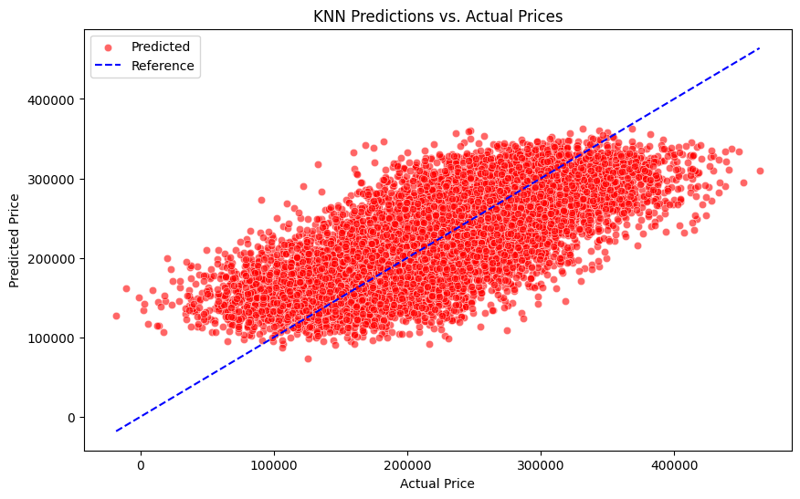
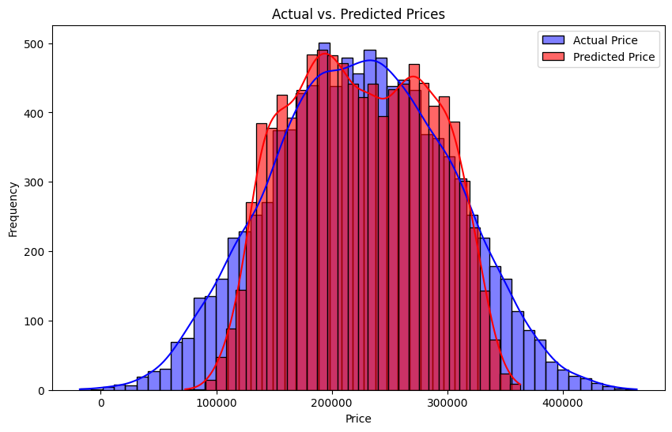

# CST 383: Final Group Project

## Table of Contents
- [Introduction](#introduction)
- [Selection of Data](#selection-of-data)
- [Methods](#methods)
- [Results](#results)
- [Discussion](#discussion)
- [Summary](#summary)
- [Link to Video Presentation](#link-to-video-presentation)
- [Works Cited](#works-cited)

# Introduction
This project was undertaken to identify and analyze the key features that significantly influence housing prices in the real estate market. Understanding these factors is crucial for buyers, sellers, and real estate professionals as it helps them make informed decisions regarding property investments and sales.

The project is aimed to explore the relationship between housing prices and various attributes such as the number of bedrooms, the neighborhood, square footage, and other significant characteristics of houses.

The tested hypotheses included:
* There is a direct correlation between the square footage of a house and its price, with larger homes likely resulting in higher prices.
* There is a direct link between housing prices and the number of bedrooms and bathrooms.
* The age of a house (year built) influences its price, with newer homes potentially being priced higher due to modern construction standards and appliances.
* A combination of factors, including location (urban vs. rural), square footage, and other features, can drastically affect the price of a home.

# Selection of Data
The dataset used for this project is the “Housing Price Prediction Data” from the Kaggle website (Imran, 2023). This dataset includes key housing attributes such as square footage, number of bedrooms and bathrooms, neighborhood, year built, and price. We ensured the dataset was clean and complete with no missing data and converted categorical data into numerical form using one hot encoding for the neighborhood column. This process transformed the neighborhood types (Suburb, Rural, Urban) into separate binary columns, converting the string values into integers to facilitate their use in machine learning algorithms. Additional features like house age and price per square foot were derived to enhance our analysis. Normalization was applied to numerical features using StandardScalar to ensure fair comparison and improve interpretability. These steps prepared the data for effective exploratory analysis and machine learning model development, crucial for identifying and understanding the factors influencing housing prices.

# Methods
Our research utilized Google Colab as our primary tool for testing and conducting our research. For our dataset we have chosen the [Housing Price Prediction Data](https://www.kaggle.com/datasets/muhammadbinimran/housing-price-prediction-data) from Kaggle (Imran, 2023). Google Docs was employed for documenting crucial findings, which were seamlessly integrated into our Google Colab notebook. Within the Google Colab notebook we also used visualization by adding different types of graphs as well as machine learning principles to help us find the correlation between different variables of the housing dataset.

Each team member contributed to answering the research question by focusing on their assigned tasks. Brian played a pivotal role in the machine learning aspect of our project, leading the exploration and discoveries related to our selected housing dataset. His expertise and efforts were instrumental in uncovering insights and patterns within the data, which significantly contributed to the overall findings of our research. Through collaborative effort and leveraging these tools, we successfully synthesized our individual contributions into a cohesive analysis that addressed the objectives of our research project effectively.

# Results
The research aimed to predict housing prices (the target) using features such as square footage, the number of bedrooms and bathrooms, neighborhood location, and the year the house was built. Through correlation analysis, we found that square footage had the strongest positive correlation with price. Both the number of bedrooms and bathrooms showed varying degrees of correlation with price, but not as strongly as square footage. This was surprising because we initially hypothesized that these would be significant factors in a house’s price. Visualizations, including scatter plots, correlation matrices, and violin plots, were utilized to depict the relationships between these features and the target variable. These visualizations revealed insights into how housing prices are distributed across different feature ranges and neighborhood types.

A baseline model was established using the mean price, which yielded a root mean squared error (RMSE) of approximately 75,762.64. The K-Nearest Neighbors (KNN) model was then used, first with the default hyperparameter values (`k=5` and `p=2`), which resulted in an RMSE of approximately 54,354.06 and an R-squared value of 0.4853. With hyperparameter tuning conducted via grid search with cross-validation, the tuning process identified the optimal parameters (`k=9` and `p=1`). This led to the KNN model achieving an improved RMSE of approximately 52,163.25 and R-squared value of 0.5260.

The following scatter plot shows the predicted values from the KNN model compared to a reference line where the predicted values equal the actual values. The closer the red dots are to the line, the better the model’s predictions.

The plot showed that while the KNN model captured the overall price distribution reasonably well, it tended to overestimate lower prices and underestimate higher prices. This pattern is further confirmed with the distribution plot below:

The distribution plot indicates that the predicted prices (in red) align fairly well with the actual prices (in blue), though there are discrepancies, particularly at the tails of the distribution. More sophisticated models might be necessary for better accuracy, especially for properties at both ends of the price spectrum.

# Discussion
The findings have several implications. The strong correlation between square footage and price confirms that larger homes typically have higher prices, aligning with general real estate trends. This finding is significant because it highlights the critical role of home size in determining market value, providing valuable insights for real estate agents, mortgage lenders, property developers, and policymakers.

Ling Zhang’s study on housing price prediction using machine learning algorithms used similar features for predicting housing prices. Zhang’s research also found that the square footage of living area (`GrLivArea`) was the most influential feature in predicting housing prices, mirroring our finding that square footage had the strongest positive correlation with price. Additionally, Zhang’s study demonstrated that advanced machine learning models, particularly XGBoost, outperformed traditional models and other machine learning techniques, achieving the lowest RMSE and highest predictive accuracy (2023).

This comparison highlights the consistency of our findings with Zhang’s study and underscores the potential for improvement through the use of more sophisticated models. While our KNN model provided reasonable predictions, Zhang’s results suggest that models like XGBoost can offer significantly better performance, particularly in terms of predictive accuracy and handling complex relationships between features.

Future research could focus on exploring more advanced machine learning algorithms, such as XGBoost, and incorporating a broader set of features, including location-specific attributes and other relevant features. Robust cross-validation techniques and larger, more diverse datasets would also help in assessing the reliability of the models.

In terms of tools, our use of Google Colab provided a convenient platform for data analysis and model training while providing an easy way to collaborate. The scikit-learn library facilitated efficient machine learning model development and hyperparameter tuning, while visualization libraries like seaborn and Matplotlib were essential for thorough data exploration and result presentation.

# Summary
In summary, this study identified that square footage is the most significant predictor of housing prices, a finding corroborated by Ling Zhang’s research. The KNN model demonstrated reasonable predictive capabilities after hyperparameter tuning but had limitations with extreme values. Advanced models like XGBoost, as highlighted by Zhang, offer potential improvements in prediction accuracy. Visualizations effectively highlighted key relationships and aided in evaluating model performance.

# Link to Video Presentation
[Video Presentation](https://youtu.be/XAxuZtB4JdY?si=khD6b31ty9HxG4fo)

# Works Cited
Imran, M. B. (2023, November 21). <i>Housing price prediction data</i>. Kaggle. Retrieved June 13, 2024, from [https://www.kaggle.com/datasets/muhammadbinimran/housing-price-prediction-data](https://www.kaggle.com/datasets/muhammadbinimran/housing-price-prediction-data)

Zhang, L. (2023). Housing price prediction using machine learning algorithm. <i>Journal of World Economy</i>, <i>2</i>(3). [https://www.pioneerpublisher.com/jwe/article/view/392](https://www.pioneerpublisher.com/jwe/article/view/392)